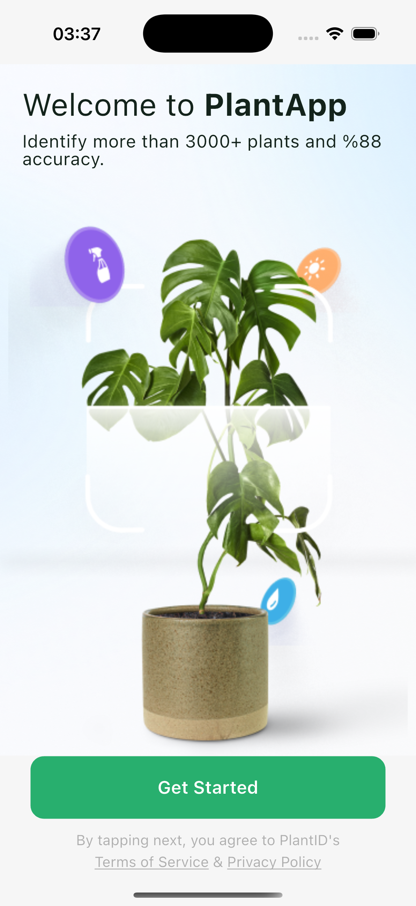
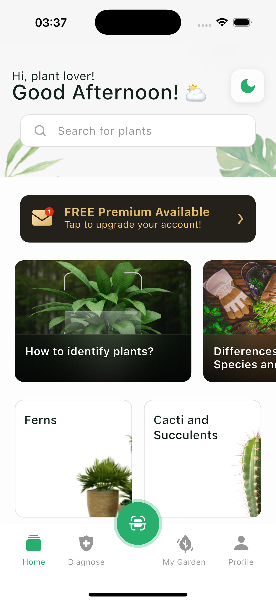
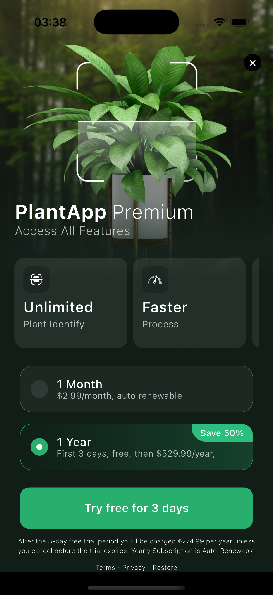

# 🌿 Plant App

A Flutter application built with Clean Architecture, featuring plant identification, disease diagnosis, and garden management capabilities. The app includes onboarding flow, home dashboard, premium paywall, and various plant-related features.

## 📱 Screenshots

<table>
  <tr>
    <td align="center">
      
      <br/>
      <b>Onboarding</b>
      <br/>
      <sub>Interactive onboarding flow for new users</sub>
    </td>
    <td align="center">
      
      <br/>
      <b>Home Dashboard</b>
      <br/>
      <sub>Categories, plant questions, and bottom navigation</sub>
    </td>
    <td align="center">
      
      <br/>
      <b>Premium Paywall</b>
      <br/>
      <sub>Subscription plans and features</sub>
    </td>
  </tr>
</table>

## ✨ Features

- 🎨 **Light & Dark Theme** support
- 📱 **Splash Screen** with app initialization
- 👋 **Onboarding Flow** for first-time users
- 🏠 **Home Dashboard** with categories and questions
- 🧭 **Bottom Navigation** - Easy navigation between Home, Diagnose, Scan, My Garden, and Profile
- 🔍 **Plant Scanner** for identification
- 🩺 **Disease Diagnosis** feature
- 🌱 **My Garden** management
- 👤 **User Profile** settings
- 💰 **Paywall** for premium features
- 📡 **Internet Connectivity** check with offline banner
- ⚡ **Shimmer Loading** effects
- 🎯 **Responsive UI** with ScreenUtil
- 🖼️ **Cached Images** for better performance

## 🛠️ Tech Stack

### Core
- **Flutter** `>=3.9.2` - Cross-platform mobile framework
- **Dart** `>=3.9.2` - Programming language

### State Management
- **flutter_bloc** `^8.1.6` - BLoC pattern implementation
- **provider** `^6.1.2` - State management
- **equatable** `^2.0.7` - Value equality for states

### Networking
- **dio** `^5.9.0` - HTTP client with interceptors
- **connectivity_plus** `^7.0.0` - Network connectivity monitoring
- **dartz** `^0.10.1` - Functional programming (Either, Failure)

### Routing
- **auto_route** `^10.2.0` - Type-safe navigation
- **auto_route_generator** `^10.2.5` - Route code generation

### Storage
- **shared_preferences** `^2.5.3` - Local key-value storage

### Dependency Injection
- **get_it** `^9.0.5` - Service locator pattern

### UI & Design
- **flutter_screenutil** `^5.9.3` - Responsive UI scaling
- **cached_network_image** `^3.4.1` - Image caching and loading
- **flutter_svg** `^2.0.10+1` - SVG rendering
- **shimmer** `^3.0.0` - Skeleton loading animations
- **webview_flutter** `^4.10.0` - In-app web browser

### Code Generation
- **json_annotation** `^4.9.0` - JSON serialization annotations
- **json_serializable** `^6.11.1` - JSON code generator
- **build_runner** `^2.4.13` - Code generation tool

### Testing
- **mocktail** `^1.0.0` - Mocking library
- **bloc_test** `^9.1.7` - BLoC testing utilities
- **flutter_test** - Flutter testing framework

## 📁 Project Structure

```
lib/
├── core/
│   ├── network/              # API configuration
│   │   ├── dio_client.dart   # HTTP client setup
│   │   ├── api_constants.dart
│   │   ├── interceptors/
│   │   └── connectivity/
│   ├── storage/              # Local storage
│   │   ├── storage_repository.dart
│   │   └── storage_repository_impl.dart
│   ├── error/                # Error handling
│   │   └── failures.dart
│   └── usecases/             # Base use case
│       └── usecase.dart
│
├── features/                 # Clean Architecture layers
│   ├── splash/
│   │   ├── presentation/
│   │   │   ├── bloc/
│   │   │   └── pages/
│   │   └── domain/
│   │       └── usecases/
│   │
│   ├── onboarding/
│   │   ├── presentation/
│   │   │   ├── bloc/
│   │   │   ├── pages/
│   │   │   └── widgets/
│   │   └── domain/
│   │       ├── entities/
│   │       └── usecases/
│   │
│   ├── home/
│   │   ├── data/             # Data layer
│   │   │   ├── models/       # JSON models
│   │   │   ├── datasources/  # API & Local sources
│   │   │   └── repositories/ # Repository implementations
│   │   ├── domain/           # Business logic layer
│   │   │   ├── entities/     # Business objects
│   │   │   ├── repositories/ # Repository interfaces
│   │   │   └── usecases/     # Business use cases
│   │   └── presentation/     # UI layer
│   │       ├── bloc/         # State management
│   │       ├── pages/        # Screen widgets
│   │       └── widgets/      # Feature widgets
│   │
│   ├── paywall/
│   ├── scan/
│   ├── diagnose/
│   ├── my_garden/
│   └── profile/
│
└── shared/
    ├── main/                 # App initialization & DI
    ├── theme/                # Light & Dark themes
    ├── utils/                # Helper functions
    └── widgets/              # Reusable widgets
        ├── app_button.dart
        ├── app_image.dart
        ├── custom_search_field.dart
        └── no_connection_banner.dart
```


## 🏗️ Architecture

This project follows **Clean Architecture** principles with three distinct layers:

- **Presentation Layer**: UI components, BLoC state management, pages, and widgets
- **Domain Layer**: Business logic, use cases, entities, and repository interfaces
- **Data Layer**: API clients, data sources, models, and repository implementations

Each feature is isolated and follows the dependency rule: dependencies point inward toward business logic.

##  Getting Started

```bash
# Install dependencies
flutter pub get

# Generate code (routes, JSON serialization)
dart run build_runner build --delete-conflicting-outputs

# Run the app
flutter run
```
